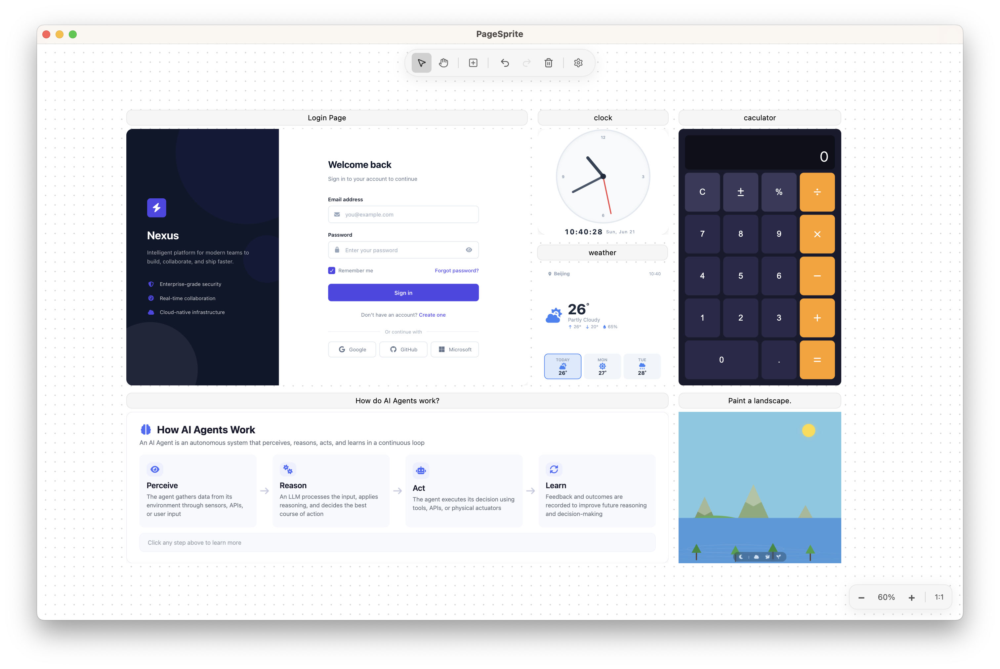
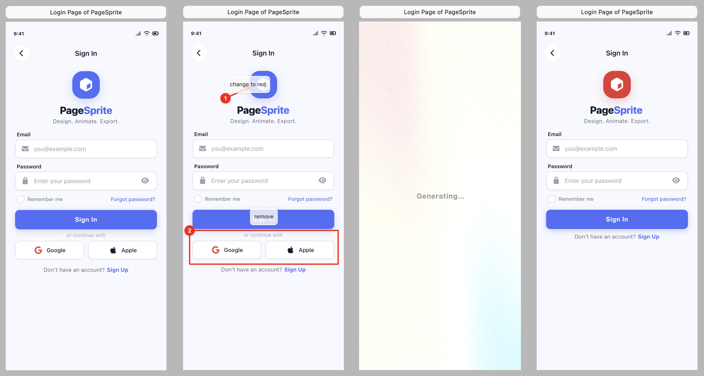

# PageSprite

AI-powered static page generator with an annotation-driven canvas workflow.

Draw rectangles on an infinite canvas, describe what you want in each region, and let AI generate the HTML — no chat panel, no context switching.



## How it works

1. **Draw** — use the rect tool to define regions on an infinite canvas
2. **Describe** — type a prompt for each region (e.g. "a sign-up form with email and password fields")
3. **Generate** — AI generates HTML that fills the region, rendered in an embedded iframe
4. **Refine** — draw annotations (arrows, highlights, rectangles, text notes) on top of generated content to guide revisions



In the annotation refinement workflow:
- Select a region and pick an annotation tool (arrow, pen, rectangle, etc.)
- Draw directly on top of the generated content to point out what needs to change
- Each annotation carries a text note describing the desired modification
- The AI receives the annotation positions mapped to the rendered DOM elements, allowing it to identify exactly which element to modify
- Annotations are consumed after each generation, keeping the feedback loop clean and focused

## Features

### Export

Each generated region can be exported individually via the region toolbar:

- **Download HTML** — exports the generated code as a standalone `.html` file with Font Awesome icons bundled
- **Download Image** — renders the region to a PNG image via headless iframe capture

### AI Backends

Multiple generation backends are supported:

| Backend | Description |
|---------|-------------|
| **Built-in Agent** | Built-in OpenAI-compatible API client. Configure endpoint, key, and model in settings. |
| **OpenCode** | CLI-based generation via [OpenCode](https://opencode.ai). |
| **Claude Code** | CLI-based generation via [Claude Code](https://claude.ai/code). |
| **Custom** | Any CLI tool with configurable arguments and template. |

## Configuration

### API Key from Environment Variable

The API key field supports `{env:VAR_NAME}` syntax to resolve values from environment variables at runtime:

| Setting value | Resolves to |
|---|---|
| `sk-actual-key-...` | Used as-is |
| `{env:OPENAI_API_KEY}` | Value of `OPENAI_API_KEY` environment variable |

This keeps secrets out of the settings file and enables per-session key configuration.

### Hooks

PageSprite can run scripts on startup via the **hooks** mechanism. Configure them in `~/.pagesprite/settings.json`:

```json
{
  "hooks": {
    "startup": ["scripts/env.sh", "scripts/proxy.sh"]
  }
}
```

Paths are relative to `~/.pagesprite/`. Supported script types:

| Platform | Supported |
|----------|-----------|
| macOS/Linux | `.sh`, `.js`, `.py` |
| Windows | `.bat`/`.cmd`, `.js`, `.py`, `.ps1` |

Script stdout can export environment variables via `KEY=VALUE` lines, making them available to the AI client (including `{env:VAR_NAME}` key resolution):

```sh
# scripts/env.sh
echo "OPENAI_API_KEY=sk-..."
echo "OPENAI_BASE_URL=https://api.openai.com/v1"
```

Hooks are useful for:
- Loading API keys from a password manager or keychain
- Starting a local proxy tunnel before the app launches
- Per-project environment setup via conditional logic in the script

## Requirements

- Node.js 20+

## Development

```bash
npm install
npm run electron:dev    # Launch Electron dev window with HMR
npm run electron:build  # Production build (creates platform installer)
```